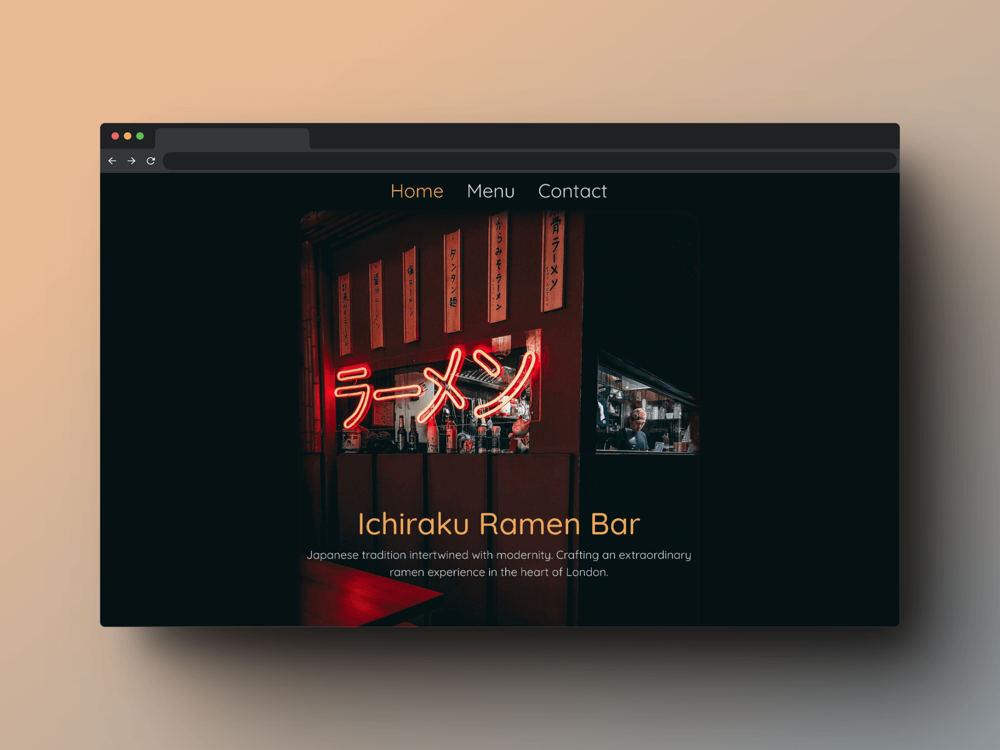

# odin-project-restaurant
A Restaurant website created in Javascript for The Odin Project

# Restaurant #

  

  

  <a href="https://scottwright-dev.github.io/odin-project-restaurant/">Click here for demo</a>

### Description
This project focuses on building a dynamic restaurant website using JavaScript to generate content in the DOM. The project utilises Webpack to organise and build the code. As per the project brief, instead of hard-coding the content, all the information is dynamically appended to a single div element in the HTML document.

### Technologies used:
- JavaScript
- HTML
- CSS
- Webpack

### What I learnt

- Utilising Webpack for project organization and building
- Dynamically generating content using only JavaScript
- Implementing ES6 Modules for modular code structure

### Thoughts and Observations

The project provided a great opportunity to explore and apply Webpack's tooling capabilities. By using Webpack, future projects can be developed with better modularity and maintainability. It was an interesting project to work on to further understand these concepts in action.

### Additional features/Enhancement ideas 
- Implement a mobile-friendly layout to support responsive design as this is currently desktop-only.
 
### Credits
- Icons: <a href="https://ionic.io/ionicons">ionic.io</a>
- Image by: <a href="https://unsplash.com/@leon_bublitz">Leon Bublitz</a> via Unsplash.com
